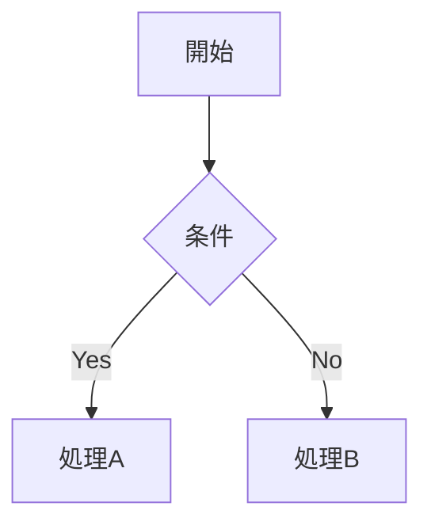

# 記事の書き方ガイド

このブログで使えるすべての記法をまとめています。
記事は MDX 形式（`.mdx`）で記述します。

---

## 記事の作成

```bash
npm run new
```

対話形式で記事 ID、タイトル、タグなどを入力すると `src/content/blog/<id>.mdx` と `public/files/<id>/` が自動生成されます。

---

## フロントマター

```yaml
---
title: "記事タイトル"
description: "記事の説明（OGP・RSSに使用）"
pubDate: "2026-04-11"          # YYYY-MM-DD（JST として解釈）
updatedDate: null               # 更新日（任意、null で非表示）
tags: ["タグ1", "タグ2"]       # タグ（自動で五十音順ソート）
pinned: false                   # true にすると一覧の先頭に固定
hidden: false                   # true にすると一覧・RSSから非表示
---
```

**日付のフォーマット:**

- `"2026-04-11"` — JST 0時として解釈
- `"2026-04-11 14:30"` — JST 14:30 として解釈
- ISO 8601 形式もそのまま使用可能

---

## 基本の Markdown

### 見出し

```md
# 見出し1（h1）
## 見出し2（h2）
### 見出し3（h3）
#### 見出し4 (h4)
##### 見出し5 (h5)
###### 見出し6 (h6)

```

h1〜h3 は目次に自動で表示されます。

### 段落・改行

通常の Markdown では改行に末尾スペース2つが必要ですが、このブログでは**単純な改行がそのまま `<br>` になります**（`remark-breaks`）。

```md
1行目
2行目（自動で改行される）
```

### 強調

```md
**太字**
*斜体*
~~取り消し線~~
__下線__
```

> [!Note]  
> `__テキスト__` は通常の Markdown では太字ですが、このブログでは **下線（`<u>`）** として扱われます。太字には `**テキスト**` を使ってください。

### リンク

```md
[リンクテキスト](https://example.com)
```

外部リンク（`http://` / `https://`）は自動で `target="_blank" rel="noopener noreferrer"` が付与されます。

### 画像

```md

```

画像ファイルは `public/files/<記事ID>/` に配置してください。

### リスト

```md
- 箇条書き1
- 箇条書き2
  - ネスト

1. 番号リスト1
2. 番号リスト2
```

### タスクリスト

```md
- [x] 完了
- [ ] 未完了
```

### 引用

```md
> 引用テキスト
> 複数行もOK
```

### コードブロック

````md
```js
console.log("Hello, world!");
```
````

シンタックスハイライトは Shiki（ライト: `github-light` / ダーク: `tokyo-night`）で自動適用されます。

### インラインコード

```md
`console.log()` のように書きます
```

### テーブル

```md
| ヘッダー1 | ヘッダー2 | ヘッダー3 |
| :-- | :--: | --: |
| 左寄せ | 中央 | 右寄せ |
| セル | セル | セル |
```

### 水平線

```md
---
```

---

## 拡張記法

### リンクカード

URL をカード形式で表示します。ビルド時に OGP 情報を自動取得します。

```md
@[](https://example.com)
@[カスタムタイトル](https://example.com)
```

ローカル記事へのリンクカードも可能です:

```md
@[](/blog/記事ID)
```

### GitHub 風アラート

```md
> [!NOTE]
> 補足情報です。

> [!TIP]
> 便利なヒントです。

> [!IMPORTANT]
> 重要な情報です。

> [!WARNING]
> 注意が必要な内容です。

> [!CAUTION]
> 危険・破壊的な操作に関する警告です。
```

アラート内でも太字、斜体、リンク、コードなどのインライン記法が使えます。

### 数式（KaTeX）

**インライン数式:**

```md
アインシュタインの式 $E = mc^2$ は有名です。
```

**ブロック数式:**

```md
$$
\int_0^{\infty} e^{-x^2} dx = \frac{\sqrt{\pi}}{2}
$$
```

### Mermaid ダイアグラム

````md

````

クライアントサイドで Mermaid.js によりレンダリングされます。

---

## メディア埋め込み

画像構文（``）の拡張として、URL の拡張子やドメインに応じて自動的に適切なメディアプレイヤーに変換されます。

### 動画

```md

```

対応拡張子: `.mp4`, `.webm`, `.mov`, `.avi` , ...

### 音声

```md

```

対応拡張子: `.mp3`, `.wav`, `.ogg`, `.m4a`, ...

### PDF

```md

```

デスクトップでは iframe で表示、モバイルではダウンロードリンクにフォールバックします。

### YouTube

YouTube の URL を画像構文で書くと自動で埋め込みプレイヤーになります:

```md


```

### Twitter / X 埋め込み

**方法1: 画像構文（自動検出）**

ツイートの URL を画像構文で書くと自動で埋め込まれます:

```md


```

**方法2: MDX コンポーネント**

```mdx
import { TwitterEmbed } from "../components/i/TwitterEmbed.astro";

<TwitterEmbed url="https://twitter.com/user/status/1234567890" />
```

**方法3: 生 HTML（`set:html`）**

Twitter の埋め込みコードをそのまま使う場合:

```mdx
<div set:html={`<blockquote class="twitter-tweet"><a href="https://twitter.com/user/status/1234567890"></a></blockquote><script async src="https://platform.twitter.com/widgets.js"></script>`} />
```

### メディアタイプの明示指定

自動判定がうまくいかない場合、タイトル属性で明示できます:

```md


```

---

## MDX 固有の機能

MDX では Markdown 内に JSX（Astro コンポーネント）を直接使えます。

### コンポーネントの import

```mdx
import { TwitterEmbed } from "../components/i/TwitterEmbed.astro";

<TwitterEmbed url="https://twitter.com/user/status/1234567890" />
```

### 生 HTML の埋め込み

```mdx
<div set:html={`<任意のHTML>`} />
```

---

## 画像ファイルの配置

記事に使う画像やメディアファイルは `public/files/<記事ID>/` ディレクトリに配置します。
`npm run new` で記事を作成すると、このディレクトリも自動で作成されます。

```
public/files/my-article/
  ├── screenshot.png
  ├── demo.mp4
  └── slides.pdf
```

MDX 内での参照:

```md


```
