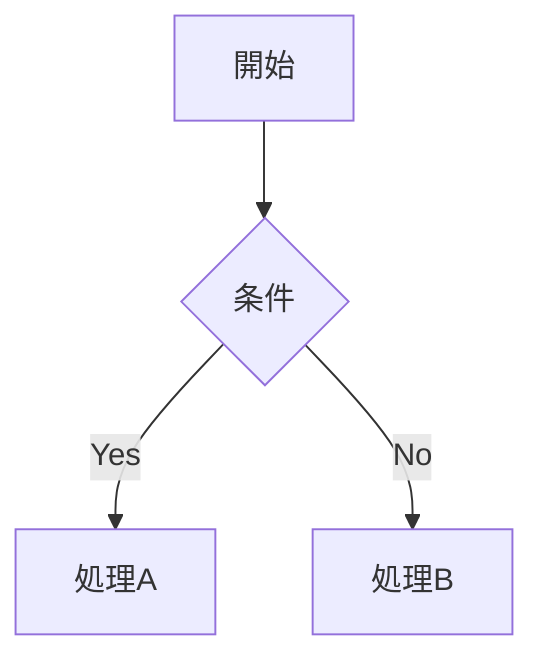

# 記事の書き方ガイド

このブログで使えるすべての記法をまとめています。
記事は MDX 形式（`.mdx`）で記述します。

---

## 記事の作成

```bash
pnpm new
```

対話形式で記事 ID、タイトル、タグなどを入力すると `src/content/blog/<id>.mdx` と `public/files/<id>/` が自動生成されます。

---

## フロントマター

```yaml
---
title: "記事タイトル"
description: "記事の説明（OGP・RSSに使用）"
pubDate: "2026-04-11"          # YYYY-MM-DD（JST として解釈）
updatedDate: null               # 更新日（任意、null で非表示）
tags: ["タグ1", "タグ2"]       # タグ（自動で五十音順ソート）
pinned: false                   # true にすると一覧の先頭に固定
hidden: false                   # true にすると一覧・RSSから非表示
---
```

**日付のフォーマット:**

- `"2026-04-11"` — JST 0時として解釈
- `"2026-04-11 14:30"` — JST 14:30 として解釈
- ISO 8601 形式もそのまま使用可能

---

## 基本の Markdown

### 見出し

```md
# 見出し1（h1）
## 見出し2（h2）
### 見出し3（h3）
#### 見出し4 (h4)
##### 見出し5 (h5)
###### 見出し6 (h6)

```

h1〜h3 は目次に自動で表示されます。

### 段落・改行

通常の Markdown では改行に末尾スペース2つが必要ですが、このブログでは**単純な改行がそのまま `<br>` になります**（`remark-breaks`）。

```md
1行目
2行目（自動で改行される）
```

### 強調

```md
**太字**
*斜体*
~~取り消し線~~
__下線__
```

> [!Note]  
> `__テキスト__` は通常の Markdown では太字ですが、このブログでは **下線（`<u>`）** として扱われます。太字には `**テキスト**` を使ってください。

### リンク

```md
[リンクテキスト](https://example.com)
```

外部リンク（`http://` / `https://`）は自動で `target="_blank" rel="noopener noreferrer"` が付与されます。

### 画像

```md

```

画像ファイルは `public/files/<記事ID>/` に配置してください。

### リスト

```md
- 箇条書き1
- 箇条書き2
  - ネスト

1. 番号リスト1
2. 番号リスト2
```

### タスクリスト

```md
- [x] 完了
- [ ] 未完了
```

### 引用

```md
> 引用テキスト
> 複数行もOK
```

### コードブロック

````md
```js
console.log("Hello, world!");
```
````

シンタックスハイライトは Shiki（ライト: `github-light` / ダーク: `tokyo-night`）で自動適用されます。

### インラインコード

```md
`console.log()` のように書きます
```

### テーブル

```md
| ヘッダー1 | ヘッダー2 | ヘッダー3 |
| :-- | :--: | --: |
| 左寄せ | 中央 | 右寄せ |
| セル | セル | セル |
```

### 水平線

```md
---
```

---

## 拡張記法

### リンクカード

URL をカード形式で表示します。ビルド時に OGP 情報を自動取得します。

```md
@[](https://example.com)
@[カスタムタイトル](https://example.com)
```

ローカル記事へのリンクカードも可能です:

```md
@[](/blog/記事ID)
```

### GitHub 風アラート

```md
> [!NOTE]
> 補足情報です。

> [!TIP]
> 便利なヒントです。

> [!IMPORTANT]
> 重要な情報です。

> [!WARNING]
> 注意が必要な内容です。

> [!CAUTION]
> 危険・破壊的な操作に関する警告です。
```

アラート内でも太字、斜体、リンク、コードなどのインライン記法が使えます。

### 数式（KaTeX）

**インライン数式:**

```md
アインシュタインの式 $E = mc^2$ は有名です。
```

**ブロック数式:**

```md
$$
\int_0^{\infty} e^{-x^2} dx = \frac{\sqrt{\pi}}{2}
$$
```

### Mermaid ダイアグラム

````md

````

クライアントサイドで Mermaid.js によりレンダリングされます。

---

## メディア埋め込み

画像構文（``）の拡張として、URL の拡張子やドメインに応じて自動的に適切なメディアプレイヤーに変換されます。

### 動画

```md

```

対応拡張子: `.mp4`, `.webm`, `.mov`, `.avi` , ...

### 音声

```md

```

対応拡張子: `.mp3`, `.wav`, `.ogg`, `.m4a`, ...

### PDF

```md

```

デスクトップでは iframe で表示、モバイルではダウンロードリンクにフォールバックします。

### YouTube

YouTube の URL を画像構文で書くと自動で埋め込みプレイヤーになります:

```md


```

### Twitter / X 埋め込み

**方法1: 画像構文（自動検出）**

ツイートの URL を画像構文で書くと自動で埋め込まれます:

```md


```

**方法2: MDX コンポーネント**

```mdx
import { TwitterEmbed } from "../components/i/TwitterEmbed.astro";

<TwitterEmbed url="https://twitter.com/user/status/1234567890" />
```

**方法3: 生 HTML（`set:html`）**

Twitter の埋め込みコードをそのまま使う場合:

```mdx
<div set:html={`<blockquote class="twitter-tweet"><a href="https://twitter.com/user/status/1234567890"></a></blockquote><script async src="https://platform.twitter.com/widgets.js"></script>`} />
```

### メディアタイプの明示指定

自動判定がうまくいかない場合、タイトル属性で明示できます:

```md


```

---

## MDX 固有の機能

MDX では Markdown 内に JSX（Astro コンポーネント）を直接使えます。

### コンポーネントの import

```mdx
import { TwitterEmbed } from "../components/i/TwitterEmbed.astro";

<TwitterEmbed url="https://twitter.com/user/status/1234567890" />
```

### 生 HTML の埋め込み

```mdx
<div set:html={`<任意のHTML>`} />
```

---

## 画像ファイルの配置

記事に使う画像やメディアファイルは `public/files/<記事ID>/` ディレクトリに配置します。
`pnpm new` で記事を作成すると、このディレクトリも自動で作成されます。

```
public/files/my-article/
  ├── screenshot.png
  ├── demo.mp4
  └── slides.pdf
```

MDX 内での参照:

```md


```

### Web ファイル管理画面

エクスプローラからファイルを直接コピーする代わりに、VSCode 風の Web UI で管理することもできます。

```bash
pnpm file                   # article/<id> ブランチ上で実行 → 対象記事を自動判定
pnpm file <記事ID>           # 明示指定
```

`http://127.0.0.1:12631/` に立ち上がり、左サイドバーにファイル一覧、右ペインにプレビュー＋操作が表示されます。

| 機能 | 動作 |
|---|---|
| アップロード | サイドバーの「アップロード」ボタン、または画面に**ドラッグ&ドロップ** (複数同時可) |
| プレビュー | 画像 / 動画 / 音声 / PDF をその場で表示 |
| **編集** (画像のみ) | トリミング / 回転 / 反転 / ズーム / 1px ナッジ (キーボード `← ↑ ↓ →` `Shift+矢印` `+ -` `0` `Ctrl+S` 対応) |
| リネーム | 上部の入力欄を編集 → Enter または「適用」ボタン |
| 削除 | 「削除」ボタン (確認ダイアログあり) |
| Markdown コピー | `` を一発コピー |
| URL コピー | 公開 URL のみコピー |

#### 対応ファイル形式

| 種別 | 拡張子 | 保存時の処理 |
|---|---|---|
| 画像 (静止画) | `.jpg` `.jpeg` `.jpe` `.jfif` `.png` `.webp` | **形式を保持したまま準ロスレス圧縮** (JPEG=mozjpeg q88 / PNG=パレット量子化 q90 / WebP=q90)。元より小さくなる場合のみ置換。 |
| 画像 (要変換) | `.avif` `.bmp` `.tif` `.tiff` `.heic` `.heif` `.svg` | AVIF はそのまま。BMP/TIFF は PNG に変換 (量子化)。HEIC/HEIF は `heic-convert` 経由で JPEG に変換。SVG はベクタのまま保持。 |
| 画像 (アニメ) | `.gif` `.apng` | 元形式のまま保存 (アニメーションを保持)。静止 GIF は PNG に変換。 |
| 動画 | `.mp4` `.m4v` `.webm` `.mov` `.avi` `.wmv` `.asf` `.mkv` `.flv` `.f4v` `.mts` `.m2ts` `.ts` `.ogv` `.3gp` `.vob` `.rm` `.rmvb` | そのまま保存 |
| 音声 | `.mp3` `.wav` `.ogg` `.oga` `.opus` `.m4a` `.m4b` `.aac` `.wma` `.aiff` `.aif` `.caf` `.flac` `.mid` `.midi` `.amr` | そのまま保存 |
| PDF | `.pdf` | そのまま保存 |

> ブラウザでのプレビュー可否はブラウザ依存です (例: `.mov` は Safari でのみ完全再生)。Web ブログでの埋め込みも同様なので、`.mp4` / `.webm` / `.mp3` / `.ogg` など Web 標準形式を推奨します。

#### ファイル名のルール

ファイル名は **半角英数字・ハイフン (`-`) ・アンダースコア (`_`)** + 拡張子 のみ使用できます (記事 ID と同じ制限)。

- **アップロード時**: 元のファイル名から許可外の文字 (日本語・空白・記号など) を自動で**除去**して保存します (例: `山の写真 (2024).jpg` → `2024.jpg`)。
- **リネーム時**: 上記ルールに合わない名前は拒否されます (`my-file.png` は OK / `my file.png` は NG)。

### 画像の一括圧縮

すでに配置済みの画像を、**画質をあまり落とさず**圧縮してサイズを削減できます。拡張子は変わらないので、記事内の `` 参照は壊れません (対象は PNG / JPEG)。

```bash
pnpm comp                   # article/<id> ブランチ上で実行 → 対象記事を自動判定
pnpm comp <記事ID>           # 記事を明示指定
pnpm comp:all               # public/files/ 内のすべての記事をまとめて圧縮
```

- PNG はパレット量子化 (品質 90)、JPEG は mozjpeg (品質 88) で再圧縮します。
- 元より小さくならないファイルは置換せずスキップするため、**何度実行しても安全**です。
- `pnpm file` でアップロードした画像は保存時に自動圧縮されるので、通常は追加で実行する必要はありません。古い記事の画像をまとめて圧縮したいときに使います。

---

## サムネイル（OGP画像）のカスタマイズ

OGP 画像（SNS シェア時のプレビュー）の **背景は記事ごとに差し替えられます**。タイトル文字とサイト名は自動で合成されます。

### デフォルト

何もしなければ全記事共通で `public/thumbnail.png` が背景に使われます。

### Web エディタで作る

```bash
pnpm thumbnail              # article/<id> ブランチ上で実行 → 対象記事を自動判定
pnpm thumbnail <記事ID>      # 明示指定
```

`http://127.0.0.1:12630/` にエディタが立ち上がり、以下のことができます:

- 画像のアップロード（PNG / JPEG / WebP）
- トリミング枠の自由移動・リサイズ（アスペクト比 1200:630 ロック）
- 回転 (90°) / 水平・垂直反転 / ズーム
- 1px 単位のナッジ（ボタン or 矢印キー）

**キーボードショートカット (Canva風)**

| キー | 動作 |
|---|---|
| `←` `↑` `↓` `→` | 1px ナッジ |
| `Shift` + 矢印 | 10px ナッジ |
| `+` / `-` | ズームイン / アウト |
| `0` | リセット |
| `Ctrl+S` (Mac: `⌘+S`) | 保存 |

保存すると `public/files/<記事ID>/_thumbnail.png` (1200×630) に書き出され、次回ビルドで反映されます。

### 直接画像を置く

エディタを使わず、`public/files/<記事ID>/_thumbnail.png` (または `.jpg` / `.jpeg` / `.webp`) を **1200×630 px ぴったり** で配置するだけでも有効です。サイズが違うとビルドが失敗します。

```
public/files/my-article/
  └── _thumbnail.png      # 1200×630 px
```
