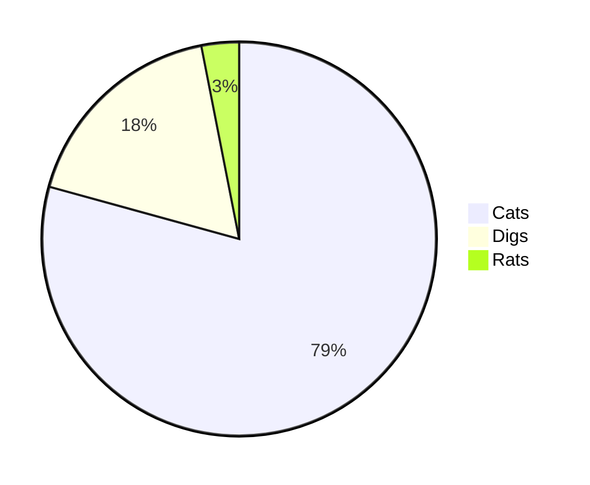

**[FUN Advent Calendar 2025 Part1](https://adventar.org/calendars/11754)** 3日目の記事です！

どうも、まろんです。
技術とドメインの話が好きな変な人です。学部1年です。
最近は技術系のイベントに参加したり、ネタ開発やらカスのOSS開発をしてます(よく分かる説明スライド→[道南リモートワーカーお茶会 vol.2](/blog/donan-remoteworker_2))。
最近Twitterのアイコン変えました。

[](https://twitter.com/rin_montblank)

ネタが思い浮かばんかったのでカスのブログ(これ)を作った話を…

## 独白

個人ブログ、かっこいいですよね。
QiitaやZennなどの情報共有プラットフォームが存在する現在では別に特別必要は無いですが、浪漫は大事であります。
前々から個人ブログは欲しかったけれども、「いつか作ろう」と思っている間に月日は流れ…
まあ、ブログ作っても文章力無いのでまともに書けないんですが…
そんなときに「作るんやで」促されこの度個人ブログを作ることになりました。めでたし。

<div set:html={`<blockquote class="twitter-tweet" data-media-max-width="560"><p lang="ja" dir="ltr">作るんやで <a href="https://t.co/qkPZeeCInz">https://t.co/qkPZeeCInz</a></p>&mdash; Jugesuke (@jugesuke) <a href="https://twitter.com/jugesuke/status/1959169004595290483?ref_src=twsrc%5Etfw">August 23, 2025</a></blockquote> <script async src="https://platform.twitter.com/widgets.js" charset="utf-8"></script>`} />

しかし、当時は様々なタスクに忙殺され個人ブログ開発にまで手を回す気力とモチベーションが湧かなかったのでした。
そこで、__後々のメンテナンス性やまともな設計という概念をすべて放り投げてカスの構成で形にする__ことに。もともとそんなものはないというツッコミはNG。

そんなこんなで脳死でドメインを取得。
悲しきかな、後先考えずにとりあえず実行するのはおそらく未来大生の習性であります。 *嗚呼、シベリア。我がウンテル、デン、リンデンよ。余は記し遺すことにした。彼の太田豊太郎のように。これは余の生涯最後の文学にして、懺悔である。*


さて、最近のモダンなブログといえば、**Next.js**や**WordPress**で作られたものなどがありますが、かくいう私は__生粋のReactアンチ兼WordPressアンチ__。
そんなReactに侵されたスタックや、プラグインを入れるたびに重くなりセキュリティホールが無限に湧いてくる~~**脆弱性の塊**~~を使うわけがなく…

そんなわけで今回採用したのは、それら膨張し過ぎたモダンフレームワークへのアンチテーゼとも言える「カスの構成」(もとい、ただの思考停止)は **Vite + Raw HTML / Express** といういつの時代か分からない構成でした。

## カスの構成の内訳

さて、私が作り上げてしまった__「技術的負債のキメラ」__について話しましょう！

### 内訳

#### 1. 継ぎ接ぎのWebのエディターを実装する

自分は愚かな人間であります。ゆえに、本質を見誤り脇道に逸れてしまうのです。

この手の自作ブログでは入稿システムを作らず、MarkdownファイルをGitで管理してデプロイする方法を採用するのが普通で賢いのであります。VSCodeやメモ帳などでローカルPC内で書いてPushすれば終わりなので。

しかし、QiitaやZennのように、Web上で記事を書けるようにしたいという浪漫だけは捨てきれませんでした。愚か。

その結果、

変な逆張り精神を発揮せずにモダンなフレームワークを使っておけばその程度数時間でデプロイできそうなものなのに数日かかりました。時間の無駄。
Viteを使うときにConfigなんて精々プラグインの追加くらいしか行わないと思いますが、「手動でChunkを分割」し「正規表現でアセットの振り分けを行う」というのを [vite.config.js](https://github.com/otoneko1102/blog/blob/main/vite.config.js) に長々と記述する奇行に走っています。
これこそが、フレームワークというレールから外れたコーダーにAssignされたIssue(s)=罰。

---

QiitaやZennを目指しているならエディターの横にプレビューがないとお話にならないのであります。余計な作業ばかり増えます。
そこでDiscordに寄せたカスタムルールを作成してmarkedベースのパーサーを作成しました。([routes/src/scripts/utils/markdown.js](https://github.com/otoneko1102/blog/blob/main/routes/src/scripts/utils/markdown.js))
余談、最近の一般的なMarkdownだと `__テキスト__` は__下線__になるかと思いきや、**強調**になるんですよね。直感に反していてとてもよろしくないと思います。DiscordのMarkdownではこれが__下線__になってます。

ただのMarkdownパーサーではなく、非公開記事用の画像プレビュー用のカギを生成するロジックなども追加しているのでシンプルに**単一責任の原則**に違反しています。~~企業LTのときにあれだけ言われたのであずらたさんにぶん殴られそうな気がします。~~

#### 2. 今後のことを一切考えていない拡張性ゼロの構成

コンポーネントって何ですか？ **React**や**Vue**、**Svelte**を使っている皆さんなら当たり前のように恩恵を受けている概念(普段はSvelteを使用しているので私も恩恵を受けていますが)。
そんなものは **Vite + Raw HTML** では使わない。

---

あなたは **JSX / TSX** は好きですか？
そう、嫌いですね、嫌いなんですよ。
そんなもの使わなくたって__Web開発はできる__んです。~~Fxxk React!~~
あなたにはテンプレートリテラルを授けましょう。**JSX / TSX** などというエコシステムは存在しないこの~~Xx_理想郷_xX~~ではJSファイル内にテンプレートリテラルでHTMLのコンポーネント(？)を記述してひたすらDOM操作します。素晴らしいですね。([routes/src/scripts/ui/\*](https://github.com/otoneko1102/blog/tree/main/routes/src/scripts/ui))
エディタのシンタックスハイライト？効くわけないでしょう、ただの文字列なんだから。メモ帳コーダーにもっと敬意を払ってください。

#### 3. TailwindCSSはCSSではない

**TailwindCSS**は邪道だと僕の魂が訴えかけてくるので__**CSS**をそのまま直書きしましょう__。クラス名に意味を持たせずスタイルを直書きするなんて、HTMLへの冒涜であります(過激派)。そもそもそれなら `style="margin: auto;"` のように書けばいいんじゃないですかね。知らんけど。

#### 4. こんな記事を書いてる時間で書き直せば解決するのでは？

> Q. はよ直せ。

> A. カスの構成すぎて無理です。

何をとち狂ったのか、フロントエンドとバックエンドが分かれていないではありませんか。
これだと直す気力が一向に湧きません。
過去に戻れるならこの作業している自分をぶん殴りたい。

[](https://github.com/otoneko1102/blog)

## 動けばいいんだよ、動けば

そんなこんなで完成したのが、この継ぎ接ぎだらけのWordPressのようなブログです(おい)。
保守性はゼロ、拡張性はマイナス。コードを見返すと吐き気がしますね…
アドカレに間に合わせられるようにコメント機能といいね機能を作る予定でしたがクソみたいな保守性と拡張性のせいでかないませんでした。はい。
適当に作った代償はメンテナンスと新規実装のたびに地獄を見ることなのでした。

---

しかし、ブラウザ上ではサイトを開けばこのように記事が表示され、画像は表示されている。苦労して実装した自作Markdownパーサーは、数式も図表も(おそらく)綺麗にレンダリングしている。ほら、$\TeX$やグラフもちゃんも表示できますよ！

$$
\frac{1}{\pi}=\frac{2\sqrt{2}}{99^2}\sum^\infty_{n=0}\frac{(4n)!(1103+26390n)}{(4^n99^nn!)^4}
$$


CodeもちゃんとSyntax Highlightされますし…

> .coffee
```coffee
console.log "Hello World!"
```
> .js
```js
// Generated by CoffeeScript 2.7.0
(function() {
  console.log("Hello World!");

}).call(this);
```

しかも、ブラウザで編集出来るようにしたことで、パソコンを起動するのがめんどくさくてもスマホで編集することが出来る…！急がば回れとはまさにこのこと。

---

結局、裏側でどれだけ汚いコードが動いていようと、読者には関係のないことです。社会と同じです。

__**「完璧なものを完璧に計画をしてから作ろう」** と考えてずっと何もしないより、 **「カスの構成」** でも世に出した方が良い__。考えるより手を動かせ。そんな感じの思いを込めた今回のアドカレでした。

しかし、今後の私に気力があればSvelteで作り直していることでしょう(React？Next.js？知らない子ですね)。それまでは、このカスのブログと付き合っていこうと思います。

## 自作ブログを作ろうとしてる方へ

逆張り精神を捨て、__GitHub上に転がってるテンプレートを使ったりちゃんとしたフレームワークを使いましょう__。悪いことは言わん。ただし__WordPress、お前は**ダメ**だ__。

個人的には__**Astro + GitHub Actions**でMarkdown管理でのブログ__がオススメです。

---

さて、僕の話はどうでもくて、今年はなんと **Part2 / Part3** が生えてるようですね！

本日は、

Part2は **adamu of fun21 さんによる [個人開発のススメ](https://zenn.dev/syuya_abe/articles/2786854335476f)** です！
Part3は 未定です！

明日は、

Part1は **こはぜ さんによる [コードを書くための基盤 ─ 健康](https://ma41.hatenablog.com/entry/2025/12/04/195240)** が書かれるそうです！
Part2は **Diawel / まっさん による [Next.jsの離脱防止は結局どうするのがいいのか](https://zenn.dev/diawel/articles/a2100d09614bb3)** が書かれるそうです！
Part3は 未定です！

Part3の6日目の記事を書いたのでよかったらそっちも読んでください！
[「ハッカソンアンチ」が考える、より良いチーム開発において大切なこと](/blog/funadventar_2025-3)

それでは。

## リポジトリと実際のブログ(供養)

https://github.com/otoneko1102/blog
https://domainfo.blog
https://blog.montblank.fun

## 引用

[紙城境介 - 元カップルは帰省する①　シベリアの舞姫 (継母の連れ子が元カノだった)](https://kakuyomu.jp/works/1177354054883783581/episodes/1177354054894934131)