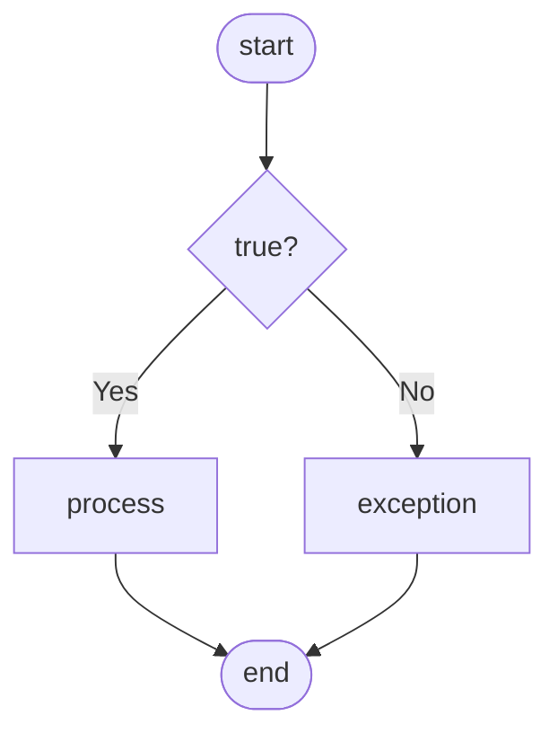

https://github.com/otoneko1102/blog#readme

## Example

```mermaid
graph
  A([start]) --> B{true?}
  B -- Yes --> C[process]
  B -- No --> D[exception]
  C --> E([end])
  D --> E
```
## 編集画面

## 使用パッケージ

https://www.npmjs.com/marked
https://www.npmjs.com/mermaid
